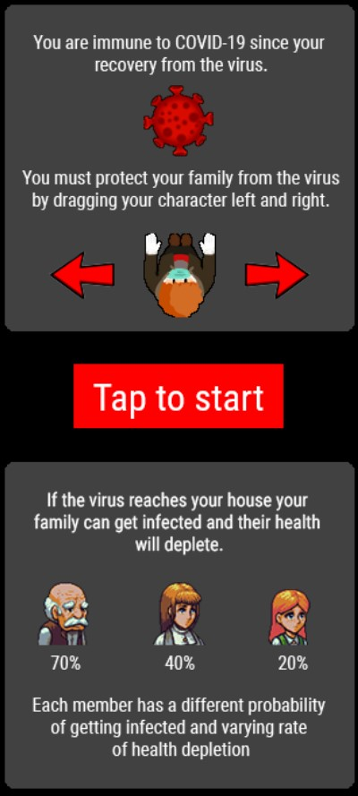

# Quarantine-DQN
- Deep Q-learning, a neural network to approximate the Q-value function (the best possible move) for a given state.
---

## What is it?
- A game bot using Deep Q-learning at its core.
- 
---

## How does it work?
- Trainning: The bot has played over 500 episodes of this game finding the objective of this game on its own, it is simply fed with the raw pixels of a game with the possible moves at any given state along with the score that results after taking an action. 
- Testing: Captures the screen, converts into a numpy array, feeds into a target DQN to approximate the Q-value(action) for the state.
---

- Game available at: https://quarantine-play.firebaseapp.com/
